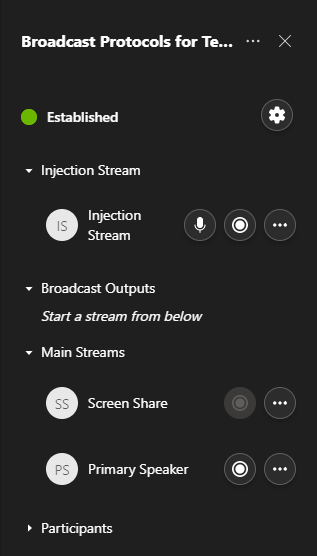

# Web UI for the Broadcast Development Kit

This repository contains a sample [application for Teams meetings](https://docs.microsoft.com/en-us/microsoftteams/platform/overview) to control the [Broadcast Development Kit](https://github.com/microsoft/Teams-Broadcast-Extension) solution. This application can be loaded into Teams as an in-meeting app to use within the Teams client. 

This Teams app is developed as a single page application (SPA) in React and TypeScript.

## Exploring the repository

The repository is structured in the following directories:
- **src**: Contains the source code of the application.
- **public**: Contains static files that are used in the application, including configuration files.
- **manifest**: Contains the manifest file for the Teams app and the icons.
- **docs**: Contains the documentation on the solution (TBC).

## Dependencies
- This is not an standalone application. It requires an instance of the [Broadcast Development Kit](https://github.com/microsoft/Teams-Broadcast-Extension) to work with. Check the documentation in that repository to run the **Broadcast Development Kit** (either locally or in the cloud) before using this application.
- [Node JS and npm](docs/how-to-install-nodejs-and-npm/readme.md)
- An Office 365 tenant and a team configured with Allow uploading custom apps enabled. For more information, see [prepare your Office 365 tenant](https://docs.microsoft.com/en-us/microsoftteams/platform/concepts/build-and-test/prepare-your-o365-tenant).

## How to run the solution locally
To run the solution in a local environment please follow the guide listed below:
- [How to run the solution locally](docs/how-to-run-the-solution-locally/README.md)

## How to run the solution in Azure
To run the solution in Azure please follow the guide listed below:
- [How to run the solution in Azure](docs/how-to-run-the-solution-in-azure/README.md)

## Contributing

This project welcomes contributions and suggestions.  Most contributions require you to agree to a
Contributor License Agreement (CLA) declaring that you have the right to, and actually do, grant us
the rights to use your contribution. For details, visit https://cla.opensource.microsoft.com.

When you submit a pull request, a CLA bot will automatically determine whether you need to provide
a CLA and decorate the PR appropriately (e.g., status check, comment). Simply follow the instructions
provided by the bot. You will only need to do this once across all repos using our CLA.

This project has adopted the [Microsoft Open Source Code of Conduct](https://opensource.microsoft.com/codeofconduct/).
For more information see the [Code of Conduct FAQ](https://opensource.microsoft.com/codeofconduct/faq/) or
contact [opencode@microsoft.com](mailto:opencode@microsoft.com) with any additional questions or comments.

## Trademarks

This project may contain trademarks or logos for projects, products, or services. Authorized use of Microsoft 
trademarks or logos is subject to and must follow 
[Microsoft's Trademark & Brand Guidelines](https://www.microsoft.com/en-us/legal/intellectualproperty/trademarks/usage/general).
Use of Microsoft trademarks or logos in modified versions of this project must not cause confusion or imply Microsoft sponsorship.
Any use of third-party trademarks or logos are subject to those third-party's policies.

## License

Copyright (c) Microsoft Corporation. All rights reserved.

Licensed under the [MIT](LICENSE) license.

## Acknowledgments

The architecture used in this solution was inspired by the sample in [codeBelt/react-redux-architecture](https://github.com/codeBelt/react-redux-architecture).

---

## Things to review

> This repo has been populated by an initial template to help get you started. Please
> make sure to update the content to build a great experience for community-building.

As the maintainer of this project, please make a few updates:

- Improving this README.MD file to provide a great experience
- Updating SUPPORT.MD with content about this project's support experience
- Understanding the security reporting process in SECURITY.MD
- Remove this section from the README
