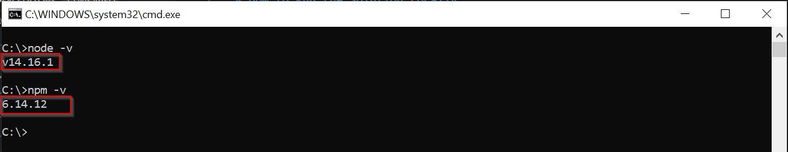

## How to install Node.js and npm

1. Check if you already have Node.js and npm installed by running in the terminal the following commands

```bash
node -v
```

```bash
npm -v
```

You will get a message (version number may change depending on the installed version) like the following: 

||
|:--:|
|*node.js and npm installed versions*|

> You can open a console by pressing `Win + R` keys, write `cmd` in the `Open` input and press `Ok`

If Node.js and/or npm are/is not installed, proceed with the following step.

2. Download [node.js](https://nodejs.org/en/) and [npm](https://docs.npmjs.com/downloading-and-installing-node-js-and-npm). If you use the [node.js installer](https://nodejs.org/en/download/), npm is already included so you don't need to download them separately. After that, you can run the commands mentioned in the step **1** and verify that were correctly installed.

