# How to run the solution in Azure

## Getting Started
The objective of this document is to explain the necessary steps to configure and run the Teams Meeting extension solution in Azure. This includes:

  - [Create a new App Registration](#create-a-new-app-registration)
  - [Create a new Azure Storage Account](#create-a-new-azure-storage-account)
  - [Prepare the solution](#prepare-the-solution)
    - [Using a released version](#using-a-released-version)
    - [Build the solution](#build-the-solution)
  - [Configure the Solution](#configure-the-solution)
  - [Upload the build to the storage container](#upload-the-build-to-the-storage-container)
  - [Zip and upload the manifest to Microsft Teams meeting](#zip-and-upload-the-manifest-to-microsft-teams-meeting)
  - [Test the Solution](#test-the-solution)

## Create a new App Registration
Create a new [App Registration](https://docs.microsoft.com/en-us/azure/active-directory/develop/quickstart-register-app) in Azure for the solution.

- `Name`: Any meaningful name (e.g: `broadcasterappextension`).
- `Authentication`:
  - `Platform configurations`: Single-page application (the Redirect URLs will be configured later).
  - `Implicit grant and hybrid flows`: Select both “Access tokens” and “ID tokens”.
  - `Supported account types`: Accounts in any organizational directory (Any Azure AD directory – Multitenant)
- `Certificates and clients`: None.
- `Token configuration`: Press on `Add groups claim` and `Save` a new one with following configuration. Keep `Emit groups as role claims` **unchecked** for all types.
  - `Id`: Group ID.
  - `Access`: Group ID.
  - `SAML`: Group ID.
- `API permissions`: Add the following Microsoft Graph permissions to this application.

API / Permission name  | Type | Admin consent
---------|----------|---------
 email | Delegated | No
 offline_access  | Delegated | No
 openid | Delegated | No
 profile | Delegated | No
 User.Read | Delegated | No

 Also add the following permission which is the API scope that had to be created when [configuring the backend](https://github.com/microsoft/Broadcast-Development-Kit/blob/main/docs/how-to-run-the-solution-in-azure/app_registrations.md#expose-an-api-1) `ManagementApi` app registration.

 API / Permission name  | Type | Admin consent
---------|----------|---------
 access_as_producer | Delegated | No

  - `Expose an API`: Skip this section for now. It will be configured later once the extension is ready to be used.
  - `App roles`: None.

After creating this App Registration copy the app ID and modify the Manifest of the App Registration created to the [Management API](https://github.com/microsoft/Broadcast-Development-Kit/blob/main/docs/how-to-run-the-solution-in-azure/app_registrations.md#how-to-setup-management-api-application-registration) adding the following property:

```json
"knownClientApplications": ["{{applicationId}}"]
```
Placeholder | Description
---------|----------
applicationId | Client Id of the App Registration created for the spa.

## Create a new Azure Storage Account

[Create](https://docs.microsoft.com/en-us/azure/storage/common/storage-account-create?tabs=azure-portal) an Storage Account that will be used to host the Meeting Extension single-page solution.

  - `Name`: Any meaningful name (e.g: `broadcastextension`).
  - `Region`: same region as the rest of the resources.
  - `Performance`: Standard.
  - `Redundancy`:  Locally-redundant storage (LRS).

Leave the rest of the settings as-is. Once this Storage Account is created, go to the Static website menu in the Data management section of the storage account. In it, change the following settings:

- `Static website`: Enabled.
- `Index document name`: index.html
- `Error document path`: index.html

||
|:--:|
|*Static Website Configuration*|

>Copy the value of `Primary endpoint` that will appear after pressing save, this value is needed later on to configure the solution.

## Prepare the solution
To deploy the solution to Azure you can either use a released version of the solution or compile the code in your machine.

### Using a released version
To deploy a released version of the solution go to the [Releases](https://github.com/microsoft/Broadcast-Development-Kit-Meeting-App/releases) page and download the Zip file for the version that you want to use.

Then un-zip that Zip file into a folder in your computer. Note that you will still need to download the contents of the `manifest` folder from the repository.

### Build the solution
1. Go to the main directory of the solution open a terminal in that directory and enter the command `npm i`. It will start the installation of the packages used by the solution which may take a few seconds.

|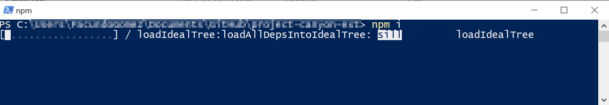|
|:--:|
|*`npm i` command is running*|

>You can open a terminal in a particular directory by holding down the ***shift*** key and right clicking on an empty space and selecting the option `Open PowerShell window here`.
>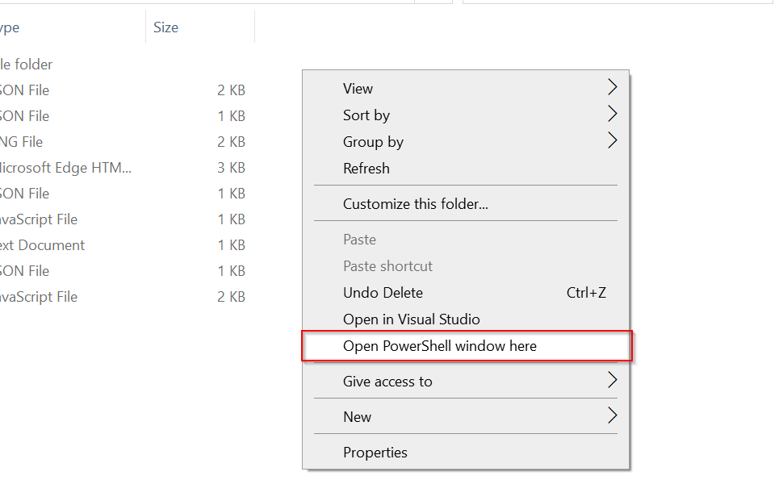

Once finished you will notice that a directory called node_modules and a package-lock.json file have been created.

2. In the same terminal enter the following command: `npm run build`.

After a few seconds the build of the solution will be finished and a new `build` directory will be created in the root directory of the solution. The terminal will display a message like the following:

|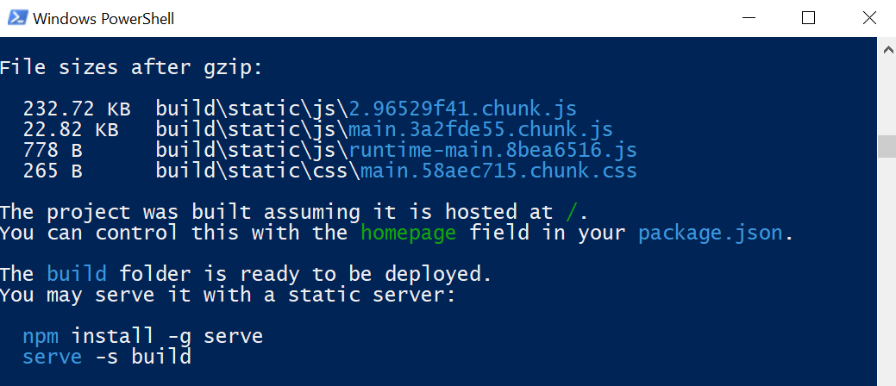|
|:--:|
|*Terminal after finishing the build*|


## Configure the solution

### Configure the App Registration

**1.** In the Azure Portal, go to the App registration created above. Click on the menu option `Authentication` of the `Manage` section and Add a new [Redirect URI](https://docs.microsoft.com/en-us/azure/active-directory/develop/quickstart-register-app#add-a-redirect-uri) with the following values:
- ```json
  {{`primaryEndpoint`}}/auth/start
  ```
- ```json
  {{`primaryEndpoint`}}/auth/end
  ```

(e.g:`https://broadcastextension.z22.web.core.windows.net/auth/start` and `https://broadcastextension.z22.web.core.windows.net/auth/end`)

**2.** Go to the `Expose an API` option in the `Manage` section menu of the App Registration. Click on the `Set` link and add the following value:

```json
api://{{primaryEndpointWithoutProtocol}}/{{spaClientId}}
```

Placeholder | Description
---------|----------
primaryEndpointWithoutProtocol | `Primary endpoint` without the protocol (`https://`) copied from `Static website` menu of Storage Account (e.g: `broadcastextension.z22.web.core.windows.net`)
spaClientId | Client Id of the App Registration of this frontend solution.

|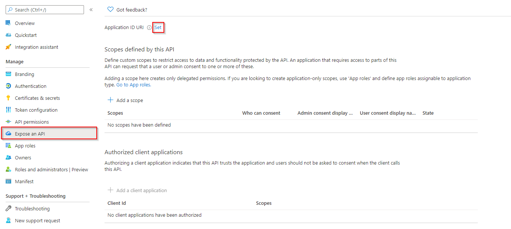|
|:--:|
|*Expose an API*|

Press on the `+ Add a scope` button and create a new scope with the following data:
- `Scope name`: "access_as_producer"
- `Who can consent?`: Admin and users
- `Admin consent display name`: "Access Broadcaster as Admin"
- `Admin consent description`: "Allow the app to read the signed-in user's profile"
- `User consent display name`: "Access Broadcaster as user"
- `User consent description`: "Allow the app to read the signed-in user's profile"

Press on the `+ Add a client application` button and fill with the following values and check the Authorized scope:
- `1fec8e78-bce4-4aaf-ab1b-5451cc387264`
- `5e3ce6c0-2b1f-4285-8d4b-75ee78787346`

|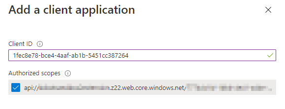|
|:--:|
|*Add a client application*|

### Setup the config.json file

Open the `config.json` file located in the `build` folder of the solution's root directory (if you followed the instructions to [Build the solution](#build-the-solution)) or in the un-zipped folder (if you followed the instructions for [Using a released version](#using-a-released-version)) and edit the following parameters:

```json
{
  "buildNumber": "0.0.0",
  "apiBaseUrl": "https://{{apiBaseUrl}}/api",
  "featureFlags": {
    "DISABLE_AUTHENTICATION": {
      "description": "Disable authentication flow when true",
      "isActive": false
    }
  },
  "authConfig": {
    "domain": "{{domain}}",
    "instance": "https://login.microsoftonline.com/",
    "tenantId": "{{tenantId}}",
    "groupId": "{{groupId}}",
    "spaClientId": "{{spaClientId}}",
    "clientId": "{{clientId}}",
  }
}

```

Placeholder | Description
---------|----------
 apiBaseUrl | Base url of the Management API hosted in Azure.
 spaClientId | Client Id of the App Registration of this frontend solution.
 clientId | Client Id of the App Registration of the ManagementApi.
 groupId | ObjectId of the group created on Azure.
 tenantId | Azure account Tenant Id.
 domain | Domain of your organization. (e.g: `mydomain.com`)

### Setup the application package

Go to the manifest folder in the root directory of the solution and edit the `manifest.json` file, which we are going to use to create the [App package](https://docs.microsoft.com/en-us/microsoftteams/platform/concepts/build-and-test/apps-package), with the following values:

```json
{
  "$schema": "https://developer.microsoft.com/en-us/json-schemas/teams/v1.9/MicrosoftTeams.schema.json",
  "manifestVersion": "1.9",
  "id": "{{spaClientId}}",
  "version": "0.0.1",
  "packageName": "text",
  "webApplicationInfo": {
    "id": "{{spaClientId}}",
    "resource": "{{apiExposed}}"
  },
  "developer": {
    "name": "Microsoft",
    "websiteUrl": "https://{{primaryEndpointWithoutProtocol}}/call/join",
    "privacyUrl": "https://{{primaryEndpointWithoutProtocol}}/privacy.html",
    "termsOfUseUrl": "https://{{primaryEndpointWithoutProtocol}}/tou.html"
  },
  "name": {
    "short": "Broadcast Development Kit",
    "full": "Broadcast Development Kit for Teams"
  },
  "description": {
    "short": "Operate the Broadcast Development Kit for Teams inside your teams meeting",
    "full": "This extension allows you to use the Broadcast Development kit for Teams solution you have deployed for your Office 365 tenant directly within Teams"
  },
  "icons": {
    "outline": "icon-outline.png",
    "color": "icon-color.png"
  },
  "accentColor": "#D85028",
  "configurableTabs": [
    {
      "configurationUrl": "https://{{primaryEndpointWithoutProtocol}}/config",
      "canUpdateConfiguration": false,
      "scopes": [
        "groupchat"
      ],
      "context": [
        "meetingChatTab",
        "meetingDetailsTab",
        "meetingSidePanel"
      ]
    }
  ],
  "staticTabs": [],
  "bots": [],
  "connectors": [],
  "composeExtensions": [],
  "permissions": ["identity", "messageTeamMembers"],
  "validDomains": ["{{primaryEndpointWithoutProtocol}}"]
}
```

Placeholder | Description
---------|----------
spaClientId | Client Id of the App Registration of this frontend solution.
apiExposed | API exposed in the App Registration (`api://{{primaryEndpointWithoutProtocol}}/{{spaClientId}}`)
primaryEndpointWithoutProtocol | `Primary endpoint` without the protocol (`https://`) copied from `Static website` menu of Storage Account (e.g: `broadcastextension.z22.web.core.windows.net`)

## Upload the build to the storage container
Open the created Storage Account go to the `Access keys` menu in the `Security + Networking` section, click on the `Show keys` button and copy the `Connection string`.

|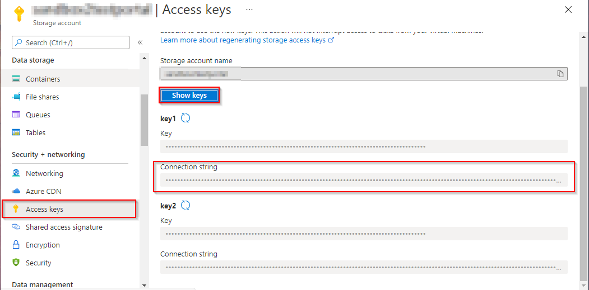|
|:--:|
|*Copy the `Connection string` of the Storage Account*|

Install and open [Microsoft Azure Storage Explorer](https://azure.microsoft.com/en-us/features/storage-explorer/). After that, click on the Connect button, select `Storage account or service`, choose the `Connection string (key o SAS)` option and click `Next`.

|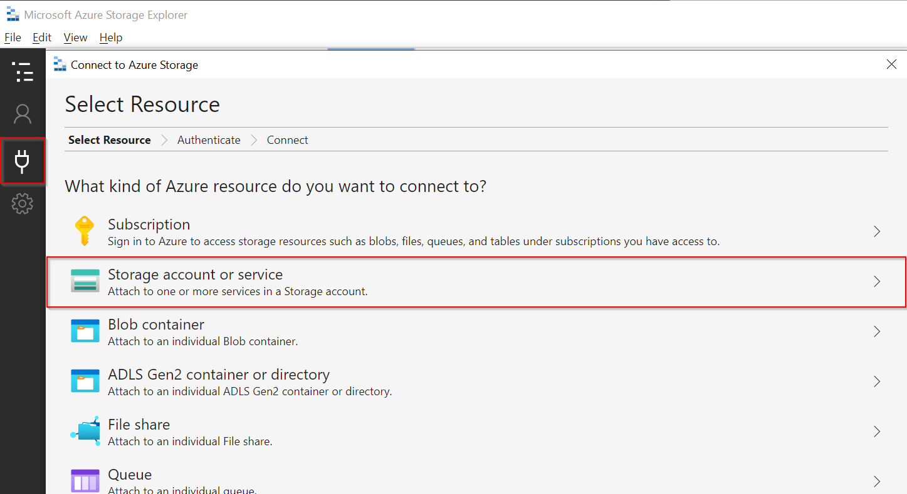|
|:--:|
|*Connect to the Storage account using the Connection String*|

In the `Connection string` field enter the connection string copied from the Storage Account and confirm the following steps.

The created storage account will appear inside the `Storage Accounts` of the Storage Explorer. Inside blob containers you will find the `$web` container.

|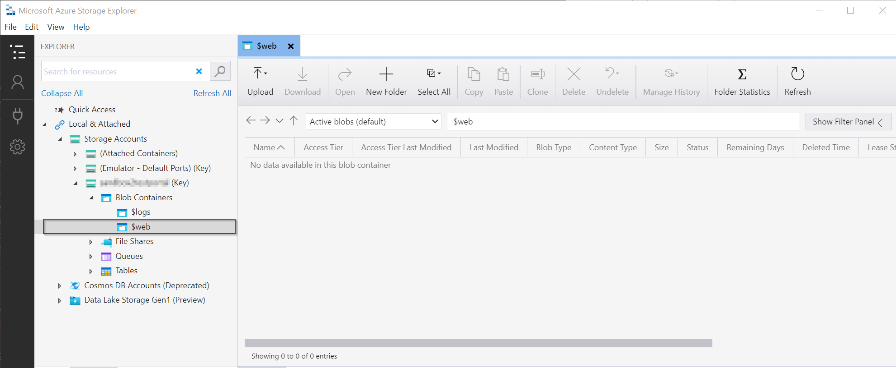|
|:--:|
|*Open the `$web` container of the Storage Account*|

Copy the files from the `build` folder generated by the solution and upload it to the `$web` container by dragging the files to it. After a few seconds the files will finish being loaded into the container and will appear inside it.

|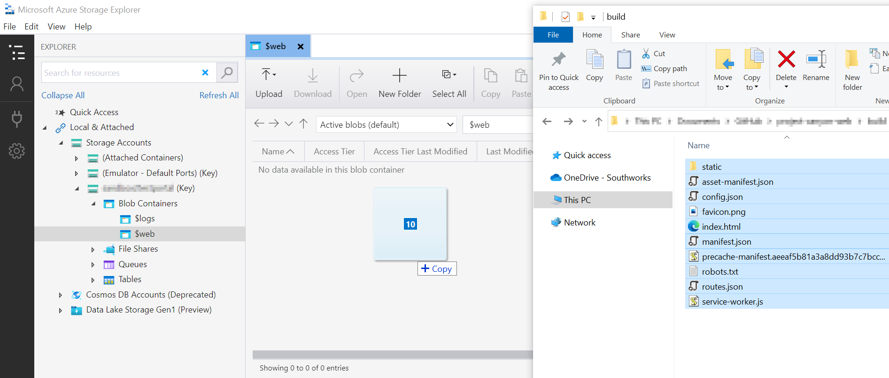|
|:--:|
|*Drag the content of the `build` folder into the `$web` container*|

## Zip and upload the manifest to Microsoft Teams meeting
Go to the manifest folder in the root directory of the solution. Select all files in the folder and right-click on them. Select `Send to` and then `Compressed (zipped) folder`. A new file named `manifest.zip` will be created.

|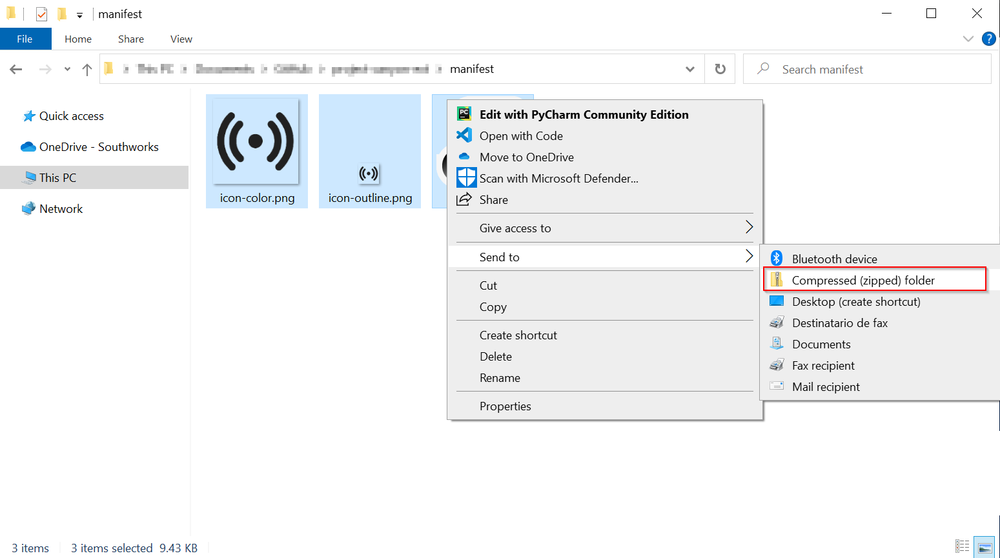|
|:--:|
|*Zip files in manifest*|

[Create](https://support.microsoft.com/en-us/office/schedule-a-meeting-in-teams-943507a9-8583-4c58-b5d2-8ec8265e04e5) a new microsoft teams meeting and click on the `+` button located at the top of the chat header of this meeting.

||
|:--:|
|*Press `+` Button*|

A new window will open, select `Manage apps` in the bottom right corner of it.

|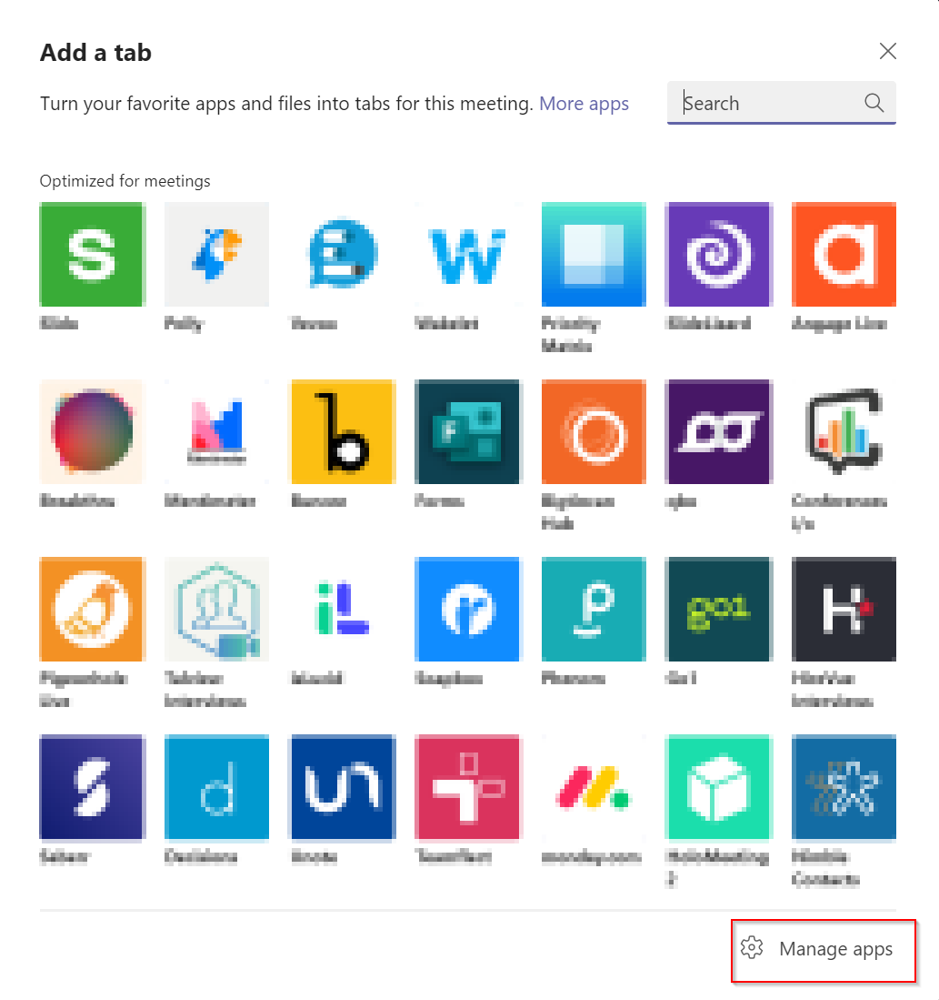|
|:--:|
|*Add a tab Window*|

On the meeting chat a new tab will open called `Manage apps` in the bottom right corner click on `Upload a custom app` and select the `manifest.zip` file we have created previously

|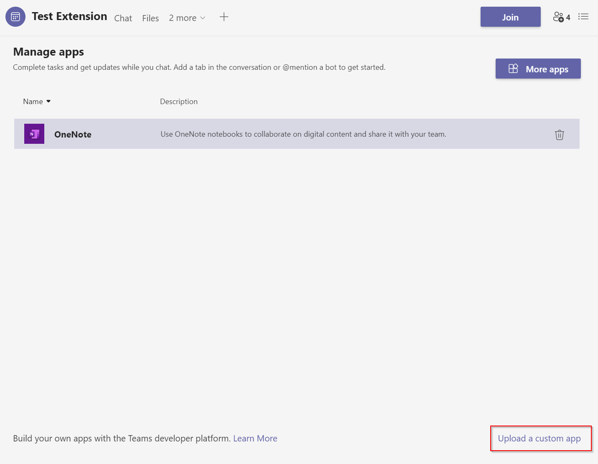|
|:--:|
|*Press on `Upload a custom app` button*|

A new window will open with details of the application, click on the `add` button.

|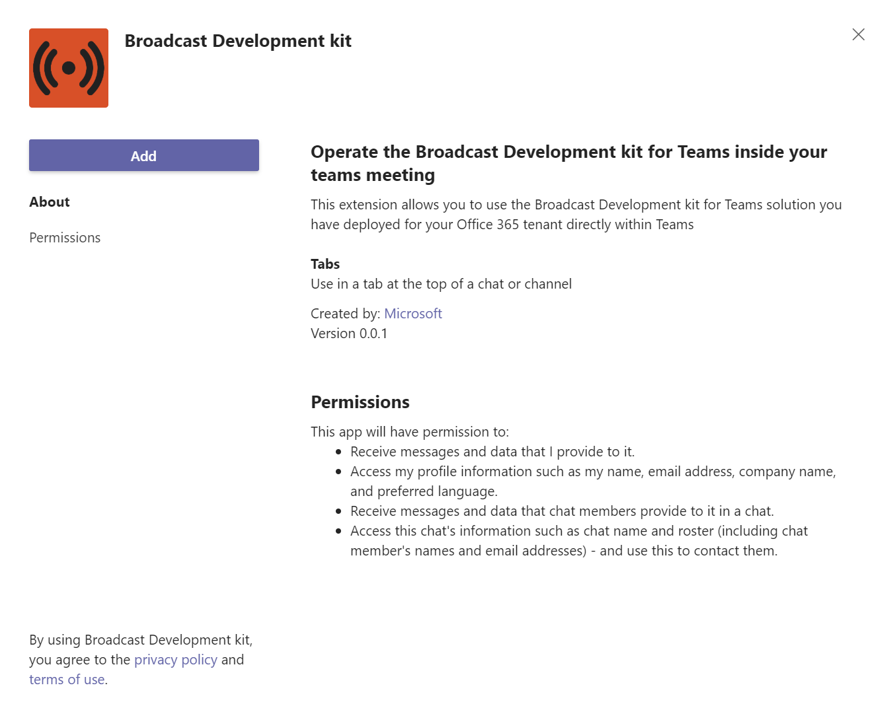|
|:--:|
|*Click on the `add` button*|

Join the meeting and click on the three dots button on the top menu, choose the option `+ Add an app` and there choose `Broadcast Development kit` application.

|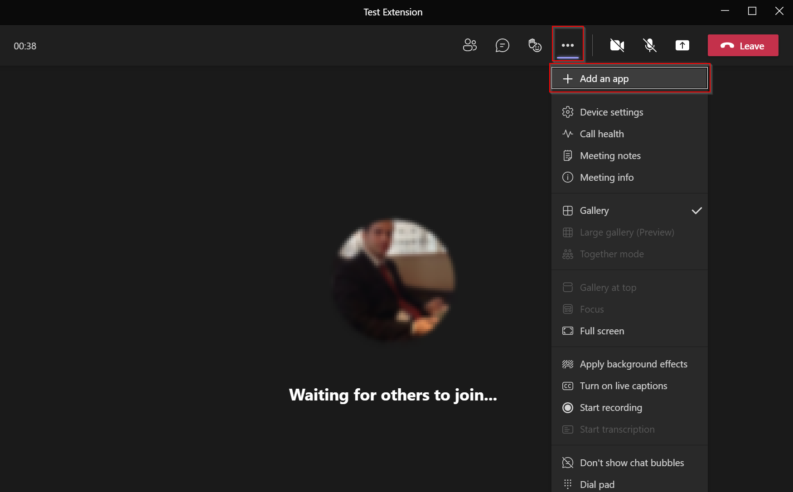|
|:--:|
|*Add the app into the meeting*|

A new window will open, press `save` to add the application.

|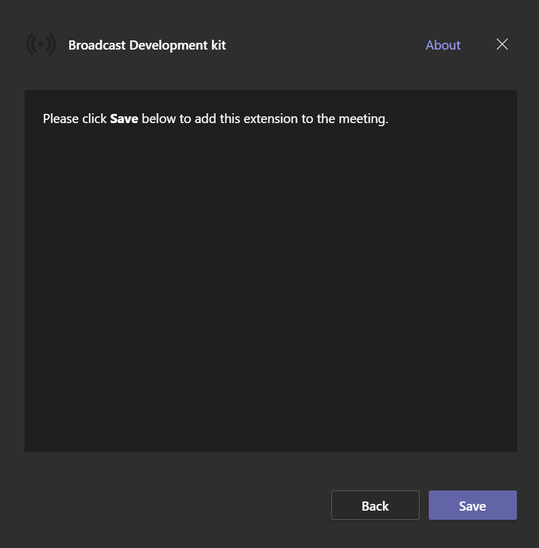|
|:--:|
|*Press save to add the app*|

## Test the solution

Once you configured the extension in the Teams meeting, and ran the local backend, click on the `Join Meeting` button to invite the bot into the meeting.

|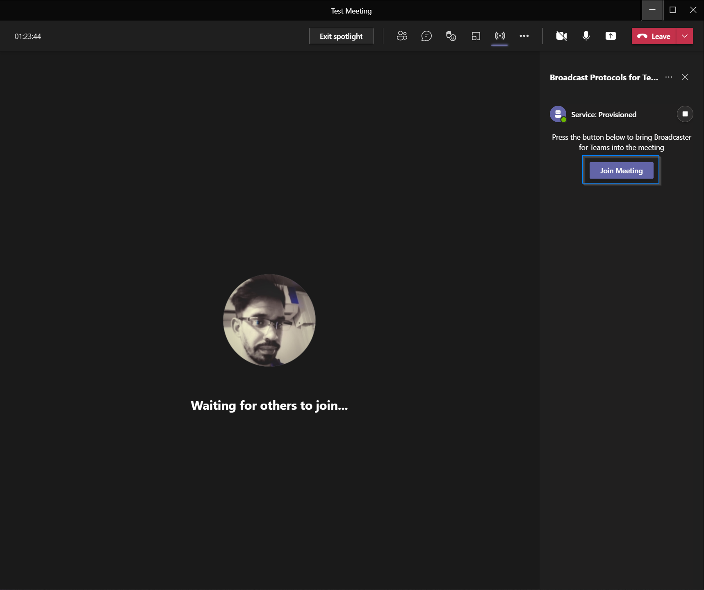|
|:--:|
|*Join Meeting*|

After a few seconds, the bot will join into the meeting, and you will see dashboard with the meeting participants and other options.

|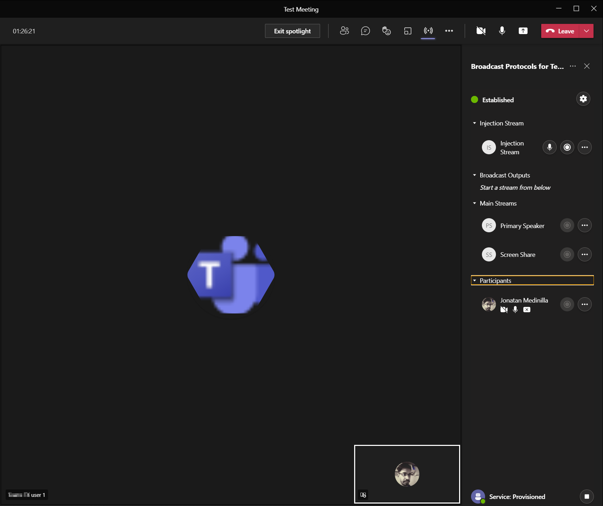|
|:--:|
|*In meeting*|

In the image below, we can see an SRT extraction of a meeting participant.

|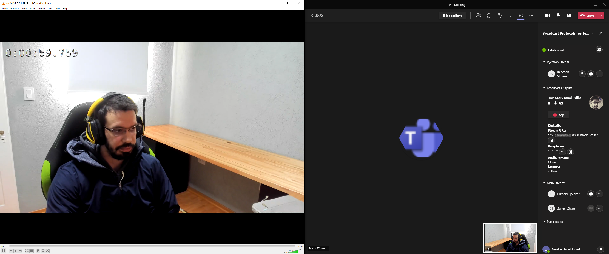|
|:--:|
|*SRT extraction example*|

