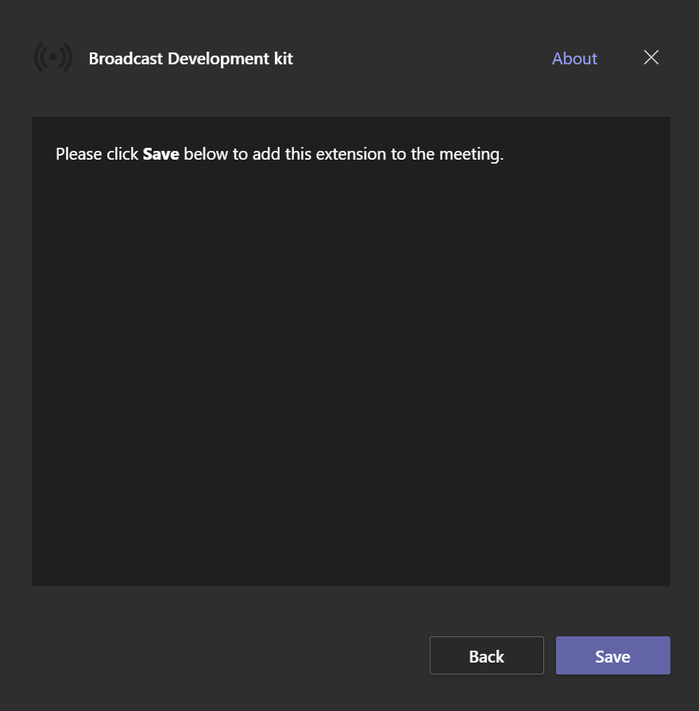

# [WIP] How to run the solution in Azure

>**This is a draft and its format and content may change in future updates.**

## Getting Started
The objective of this document is to explain the necessary steps to configure and run the Teams Meeting extension solution in Azure. This includes:

  - [Create a new App Registration](#create-a-new-app-registration)
  - [Create a new Azure Storage Account](#create-a-new-azure-storage-account)
  - [Install and Build the solution](#install-and-build-the-solution)
  - [Configure the Solution](#configure-the-solution)
  - [Upload the build to the storage container](#upload-the-build-to-the-storage-container)
  - [Zip and upload the manifest to Microsft Teams meeting](#zip-and-upload-the-manifest-to-microsft-teams-meeting)
  - [Test the Solution](#test-the-solution)

### Create a new App Registration
This app registration is optional but can be created if the organization also wants to operate the solution through a Teams Meeting extension.

- `Name`: Any meaningful name (e.g: `broadcasterappextension`).
- `Authentication`:
  - `Platform configurations`: Single-page application (the Redirect URLs will be configured later).
  - `Implicit grant and hybrid flows`: Select both “Access tokens” and “ID tokens”.
  - `Supported account types`: Accounts in any organizational directory (Any Azure AD directory – Multitenant)
- `Certificates and clients`: None.
- `Token configuration`: Add a “groups claim” with following configuration app. Keep “Emit groups as role claims” unchecked for all types.
  - `Id`: Group ID.
  - `Access`: Group ID.
  - `SAML`: Group ID.
- `API permissions`: Add the following permissions to this application.

API / Permission name  | Type | Admin consent
---------|----------|---------
 email | Delegated | No
 offline_access  | Delegated | No
 openid | Delegated | No
 profile | Delegated | No
 User.Read | Delegated | No

  - `Expose an API`: Skip this section for now. It will be configured later once the extension is ready to be used.
  - `App roles`: None.


### Create a new Azure Storage Account

[Create](https://docs.microsoft.com/en-us/azure/storage/common/storage-account-create?tabs=azure-portal) an Storage Account that will be used to host the Meeting Extension single-page solution.

  - `Name`: dronetxextension (or any other meaningful name).
  - `Region`: same region as the rest of the resources.
  - `Performance`: Standard.
  - `Redundancy`:  Locally-redundant storage (LRS).

Leave the rest of the settings as-is. Once this Storage Account is created, go to the Static website menu in the Data management section of the storage account. In it, change the following settings:

- `Static website`: Enabled.
- `Index document name`: index.html
- `Error document path`: index.html

||
|:--:|
|*Static Website Configuration*|

>Copy the value of `Primary endpoint` that will appear after pressing save, we will use it later to configure the solution.

### Install and build the solution
1. Go to the main directory of the solution open a command console in that directory and enter the command `npm i`. It will start the installation of the packages used by the solution which may take a few seconds.

||
|:--:|
|*`npm i` command is running*|

>You can open a console in a particular directory by holding down the ***shift*** key and right clicking on an empty space and selecting the option `Open PowerShell window here`.
>

Once finished you will notice that a directory called node_modules and a package-lock.json file have been created.

2. In the same command prompt enter the following command: `npm run build`.

After a few seconds the build of the solution will be finished and a new `build` directory will be created in the root directory of the solution. The console will display a message like the following:

||
|:--:|
|*Console after finishing the build*|


### Configure the solution

```json
{
  "buildNumber": "0.0.0",
  "apiBaseUrl": "https://{{apiBaseUrl}}/api",
  "releaseDummyVariable": "empty",
  "featureFlags": {
    "DISABLE_AUTHENTICATION": {
      "description": "Disable authentication flow when true",
      "isActive": false
    }
  },
  "authConfig": {
    "domain": "{{domain}}",
    "instance": "{{instance}}",
    "tenantId": "{{tenantId}}",
    "groupId": "{{groupId}}",
    "spaClientId": "{{spaClientId}}",
    "clientId": "{{clientId}}",
  }
}

```


```json
{
  "$schema": "https://developer.microsoft.com/en-us/json-schemas/teams/v1.9/MicrosoftTeams.schema.json",
  "manifestVersion": "1.9",
  "id": "{{spaClientId}}",
  "version": "0.0.1",
  "packageName": "text",
  "webApplicationInfo": {
    "id": "{{spaClientId}}",
    "resource": "api://{{primaryEndpoint}}/{{spaClientId}}"
  },
  "developer": {
    "name": "Microsoft",
    "websiteUrl": "",
    "privacyUrl": "",
    "termsOfUseUrl": ""
  },
  "name": {
    "short": "Broadcast Protocols",
    "full": "Broadcast Protocols for Teams"
  },
  "description": {
    "short": "Operate the Broadcast Protocols for Teams inside your teams meeting",
    "full": "This extension allows you to use the Broadcast Protocols for Teams solution you have deployed for your Office 365 tenant directly within Teams"
  },
  "icons": {
    "outline": "icon-outline.png",
    "color": "icon-color.png"
  },
  "accentColor": "#D85028",
  "configurableTabs": [
    {
      "configurationUrl": "https://{{primaryEndpoint}}/config",
      "canUpdateConfiguration": false,
      "scopes": [
        "groupchat"
      ],
      "context": [
        "meetingChatTab",
        "meetingDetailsTab",
        "meetingSidePanel"
      ]
    }
  ],
  "staticTabs": [],
  "bots": [],
  "connectors": [],
  "composeExtensions": [],
  "permissions": ["identity", "messageTeamMembers"],
  "validDomains": ["{{primaryEndpoint}}"]
}
```

### Upload the build to the storage container
### Zip and upload the manifest to Microsft Teams meeting
Go to the manifest folder in the root directory of the solution. Select all files in the folder and right-click on them. Select `Send to` and then `Compressed (zipped) folder`. A new file named `manifest.zip` will be created.

||
|:--:|
|*Zip files in manifest*|

[Create](https://support.microsoft.com/en-us/office/schedule-a-meeting-in-teams-943507a9-8583-4c58-b5d2-8ec8265e04e5) a new microsoft teams meeting and click on the `+` button located at the top of the chat header of this meeting.

||
|:--:|
|*Press `+` Button*|

A new window will open, select `Manage apps` in the bottom right corner of it.

||
|:--:|
|*Add a tab Window*|

On the meeting chat a new tab will open called `Manage apps` in the bottom right corner click on `Upload a custom app` and select the `manifest.zip` file we have created previously

||
|:--:|
|*Press on `Upload a custom app` button*|

A new window will open with details of the application, click on the `add` button.

||
|:--:|
|*Click on the `add` button*|

Join the meeting and click on the three dots button on the top menu, choose the option `+ Add an app` and there choose `Broadcast Development kit` application.

||
|:--:|
|*Add the app into the meeting*|

A new window will open, press `save` to add the application.

||
|:--:|
|*Press save to add the app*|


### Test the solution
