# [WIP]How to run the solution locally

>**This is a draft and its format and content may change in future updates.**
## Getting Started
The objective of this document is to explain the necessary steps to configure and run the Teams Meeting extension solution in a local environment. This includes:

  - [Install and configure ngrok](#install-and-configure-ngrok)
  - [Install the solution packages](#install-the-solution-packages)
  - [Configure the solution](#configure-the-solution)
  - [Build and run the Solution](#build-and-run-the-solution)
  - [Test the solution](#test-the-solution)

## Install and configure ngrok
To run the solution locally we need to establish a secure tunnel between Microsoft Teams and our extension. Microsoft Teams is a cloud-based product and it requires our extension content be available from the cloud using HTTPS endpoints. 

For this purpose, we use [ngrok](https://ngrok.com/), a reverse proxy softawre tool that creates a tunnel to our locally running web server's publicly-available HTTPS endpoints.

Because we have a dependency with [Broadcasts Protocols for Teams](https://github.com/microsoft/Teams-Broadcast-Extension) (backend solution from here) that also requires Ngrok, and Ngrok's free accounts only allow us to run just one instance at the same time, we recommend to create new account to get the required token to run an Ngrok instance. If you haven't downloaded Ngrok yet, you can donwload it from [here](https://www.ngrok.com/download)

Login into your new Ngrok account and in the left menu, in the `Getting Started` section, select the option `Your Authtoken` and copy it. We will use this token to configure our instance of ngrok.

|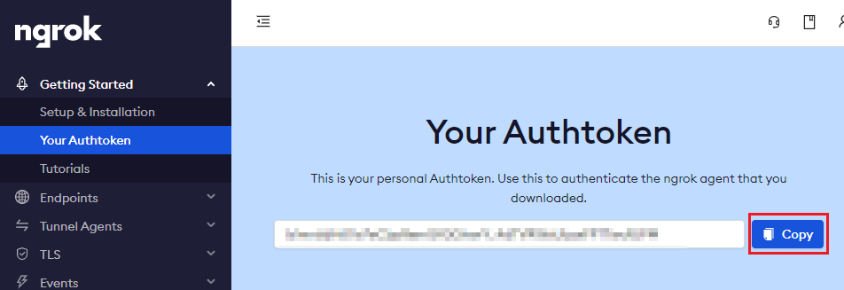|
|:--:|
|*Copy the Ngrok Authtoken*|

After that, go to the directory where you unziped the `ngrok.exe` file and create a new config file with a different name that the one you use to run the ngrok instance for the backend solution.

**Creating config file**

1. Open vscode
2. Go to File -> New file (or press Ctrl+N)


|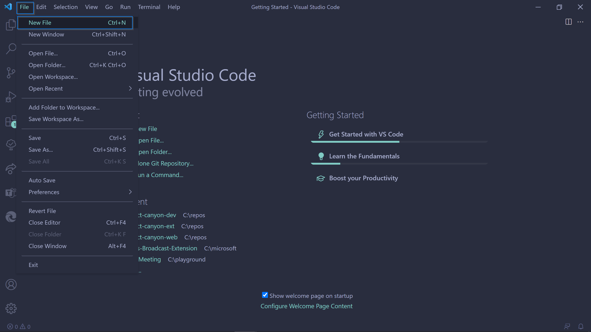|
|:--:|
|*Create new file*|

3. Select yaml as language

|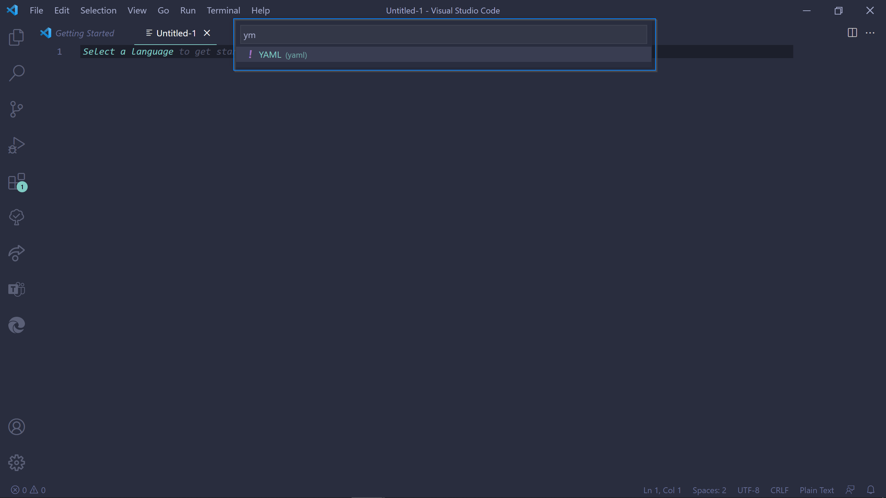|
|:--:|
|*Select language*|

4. Copy the following configuration into the yaml file and replace the text `{{PUT YOUR AUTHTOKEN HERE}}` with the value of the authtoken copied earlier from the Ngrok dashboard.

```json
authtoken: {{PUT YOUR AUTHTOKEN HERE}}
tunnels:
 extension:
  addr: 3000
  proto: http

```

|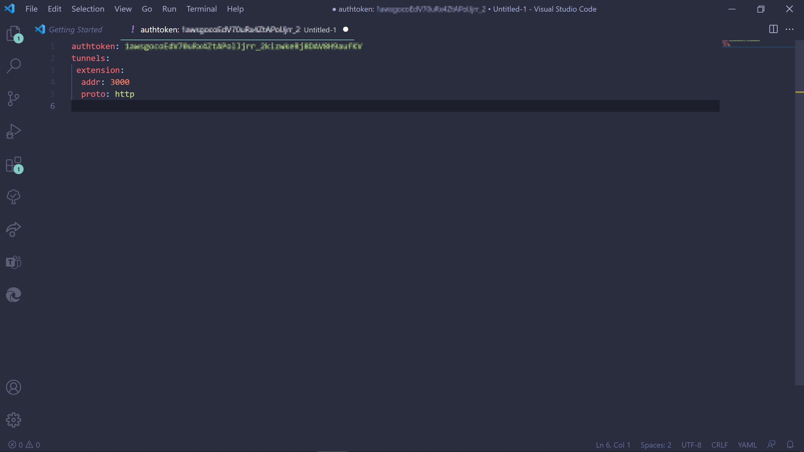|
|:--:|
|*Config file example*|

5. Go to File -> Save (or press Ctrl+S), enter the name of your file (ngrok-extension.yml in this example) and save it in ngrok's folder

|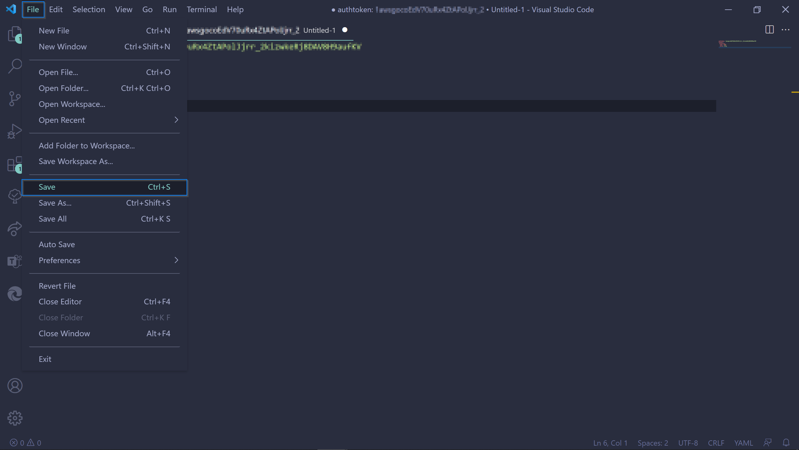|
|:--:|
|*Save file*|

|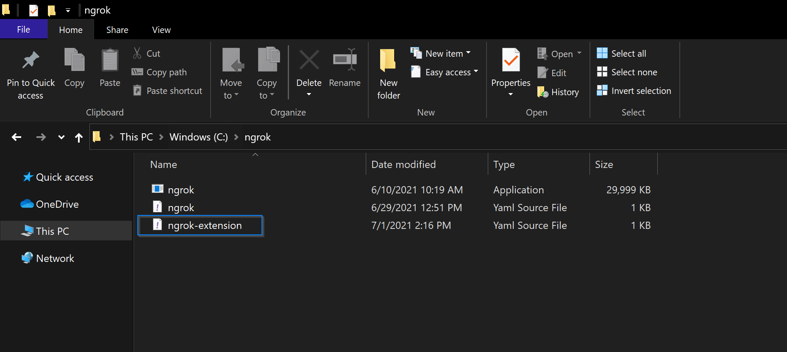|
|:--:|
|*Example result*|

>You only need to perform this initial configuration of ngrok the first time you configure the solution, then you do not need to repeat it again.
  
## Install the solution packages

Before configuring and running the solution, it is necessary to install its dependencies. To do so, go to the main directory of the solution, open a terminal window enter the command `npm i`. It will start to install the packages required by the solution.

|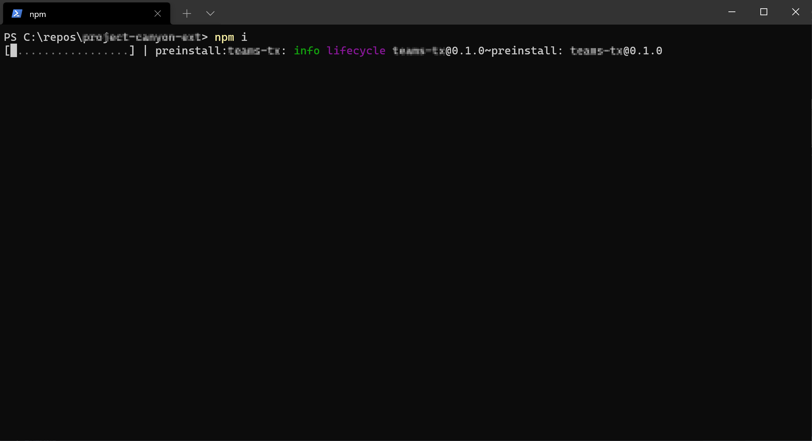|
|:--:|
|*Example of `npm i` command running*|

Once finished you will notice that a directory called node_modules and a package-lock.json file have been created.

## Configure the Solution

If we want to run the solution with the backend solution running locally,  we have to use the `config.json` as is.

**Running the solution with the backend running locally**
```json
{
  "buildNumber": "0.0.0",
  "apiBaseUrl": "https://localhost:8442/api",
  "releaseDummyVariable": "empty",
  "featureFlags": {
    "DISABLE_AUTHENTICATION": {
      "description": "Disable authentication flow when true",
      "isActive": true
    }
  }
}

```

To run the solution locally but with the backend running in Azure, you will need to create the respective [App Registration](), open the `config.json` file located in the `public` folder of the solution's root directory and edit the following parameters:

**Running the solution with the backend running in Azure**


```json
{
  "buildNumber": "0.0.0",
  "apiBaseUrl": "https://{{apiBaseUrl}}/api",
  "releaseDummyVariable": "empty",
  "featureFlags": {
    "DISABLE_AUTHENTICATION": {
      "description": "Disable authentication flow when true",
      "isActive": false
    }
  },
  "authConfig": {
    "domain": "{{domain}}",
    "instance": "{{instance}}",
    "tenantId": "{{tenantId}}",
    "groupId": "{{groupId}}",
    "spaClientId": "{{spaClientId}}",
    "clientId": "{{clientId}}",
  }
}

```
Placeholder | Description 
---------|----------
 apiBaseUrl | Base url of the Management API hosted in Azure.
 spaClientId | Client Id of the App Registration of this frontend solution.
 clientId | Client Id of the App Registration of the ManagementApi. 
 groupId | ObjectId of the group created on Azure. 
 tenantId | Azure account Tenant Id.
 instance | TBD
 domain | TBD


## Build and run the Solution


> NOTE: You must have follow all the steps every time you want to run the solution locally.

> NOTE: If you configured the extension to run it with a local backend, you must have running the backend to properly use the extension.

### Run your application in localhost
To run your application, go to the main directory of the solution, open a terminal window and enter the the following command:

```bash
npm run start
```

|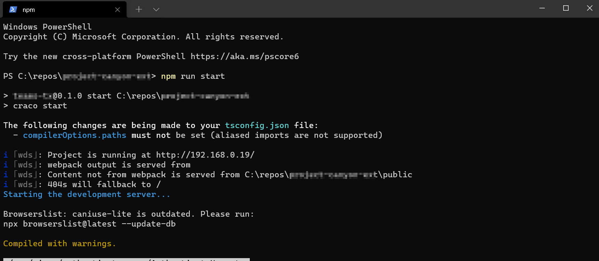|
|:--:|
|*Example of `npm run start` command running*|

After that, a browser tab will open and an error message will be displayed.If you open the Developer Tools (`Ctrl+Shift+I` in Microsoft Edge), you will see the error's datail. This is because the meeting extension depends on the Microsoft Teams SDK, and it cannot be initialized outside a teams context. To properly use the extension you will need to install the extension in a Microsoft Teams meeting.

|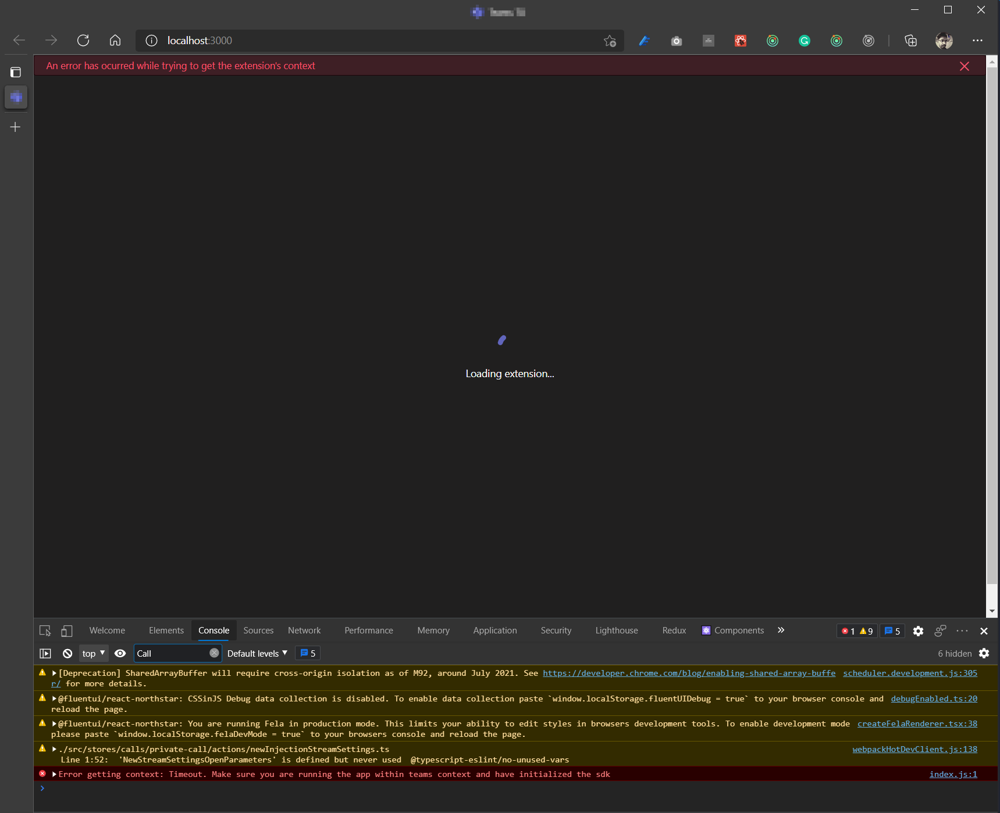|
|:--:|
|*Example of application running in localhost*|

### Create the application package
To install the extension, you must create the application package. It is a zip folder that contains the following required files:

- A full color icon measuring 192 x 192 pixels.
- A transparent outline icon measuring 32 x 32 pixels.
- A manifest.json file that specifies the attributes of your app.

Before creating the package, you need to modify manually the manifest to specify the `HOSTNAME` url (base url where the extension is going to pull the content of the SPA). Because you need to establish a secure channel between Microsoft Teams and the extension (as mentioned [here](#Install-and-configure-ngrok)), you must run ngrok to create a tunnel to our locally running web server and expose it as a publicly-available HTTPS endpoint.

Go to the directory where you put ngrok, open a windows terminal and run the following command

```bash
ngrok start --all --config ngrok-extension.yml
```

Or, if you added ngrok to the `PATH` environment variable, open a windows terminal and run the following command

```bash
ngrok start --all --config {configFilePath}\ngrok-extension.yml
```

where `{configFilePath}` is the path where you put the ngrok tool. E.g.: `c:\ngrok'.


|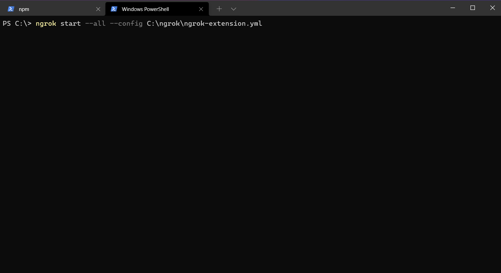|
|:--:|
|*Example of ngrok command*|

|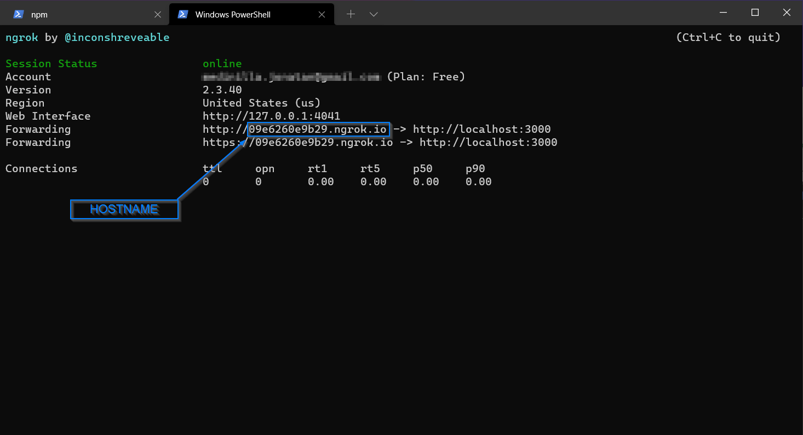|
|:--:|
|*Example of ngrok running*|

Create a `manifest.json` file under `/manifests/local` using the template you have below,  replace `{{HOSTNAME}}` with the ngrok url (without HTTP/HTTPS://) and save it.

```json
{
  "$schema": "https://developer.microsoft.com/en-us/json-schemas/teams/v1.9/MicrosoftTeams.schema.json",
  "manifestVersion": "1.9",
  "id": "00000000-0000-0000-0000-000000000000",
  "version": "0.0.1",
  "packageName": "text",
  "webApplicationInfo": {
    "id": "00000000-0000-0000-0000-000000000000",
    "resource": "api://{{HOSTNAME}}/00000000-0000-0000-0000-000000000000"
  },
  "developer": {
    "name": "SOUTHWORKS",
    "websiteUrl": "https://{{HOSTNAME}}/call/join",
    "privacyUrl": "https://{{HOSTNAME}}/privacy.html",
    "termsOfUseUrl": "https://{{HOSTNAME}}/tou.html"
  },
  "name": {
    "short": "Broadcast Protocols",
    "full": "Broadcast Protocols for Teams"
  },
  "description": {
    "short": "Operate the Broadcast Protocols for Teams inside your teams meeting",
    "full": "This extension allows you to use the Broadcast Protocols for Teams solution you have deployed for your Office 365 tenant directly within Teams"
  },
  "icons": {
    "outline": "icon-outline.png",
    "color": "icon-color.png"
  },
  "accentColor": "#D85028",
  "configurableTabs": [
    {
      "configurationUrl": "https://{{HOSTNAME}}/config",
      "canUpdateConfiguration": false,
      "scopes": [
        "groupchat"
      ],
      "context": [
        "meetingChatTab",
        "meetingDetailsTab",
        "meetingSidePanel"
      ]
    }
  ],
  "staticTabs": [],
  "bots": [],
  "connectors": [],
  "composeExtensions": [],
  "permissions": [
    "identity",
    "messageTeamMembers"
  ],
  "validDomains": [
    "{{HOSTNAME}}"
  ]
}

```

Finally, you can create the zip package with the files you have under `/manifests/local`

|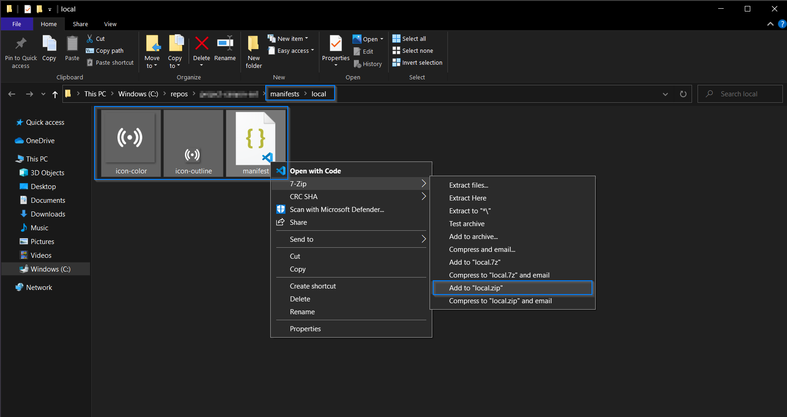|
|:--:|
|*Example of create zip package using 7zip*|


### Upload your application to Teams

{{PENDING}}


## Test the solution

{{PENDING}}