# How to use the Meeting App solution

## Introduction

## Getting Started
This document explains how to operate the Broadcast Development Kit (BDK) through the Meeting App. This includes:

- [Install Meeting App](#install-meeting-app).
- [Open the Meeting App](#open-the-meeting-app).
- [Producer view](#producer-view).
    - [Authentication](#authentication).
    - [Join the Bot into the meeting](#join-the-bot-into-the-meeting).
    - [Call details view](#call-details-view).
    - [How to inject media content into the meeting](#how-to-inject-media-content-into-the-meeting).
    - [How to extract media content from the meeting](#how-to-extract-media-content-from-the-meeting).
    - [Stream key for RTMP protocol](#stream-key-for-rtmp-protocol).
- [Attendee view](#attendee-view).

### Install Meeting App
To add the BDK Meeting App to our Microsoft Teams Client and be able to use it in a meeting, you must follow the steps described in this [document](../how-to-run-the-solution-locally/README.md#upload-your-application-to-teams).

### Open the Meeting App
To open the BDK Meeting App, please go to the top bar in the Microsoft Teams meeting window and click on the icon associated with the BDK Metting App to open it.

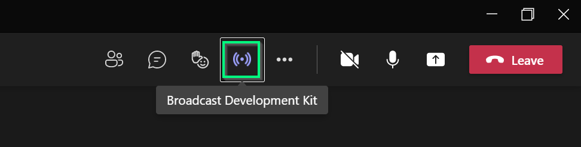

### Producer view
The producer view allows users to manage the BDK in the same way as in the portal. Once you have been successfully authenticated, the BDK Meeting App will render the Join Call view as long as the bot has not been joined to the meeting before otherwise, the [Call details view](#call-details-view) will be displayed.

### Authentication
Once you clicked on the icon, the BDK Meeting App is displayed on the right side of the meeting window. However, before rendering the content, the BDK Meeting App checks if the user can manage BDK.

Based on the user role, the Meeting App will render different views.

For users who can operate BDK, an authentication popup window will be displayed. You just need to click on the `Sign In` button and you will be ready to use the BDK Meeting App. 

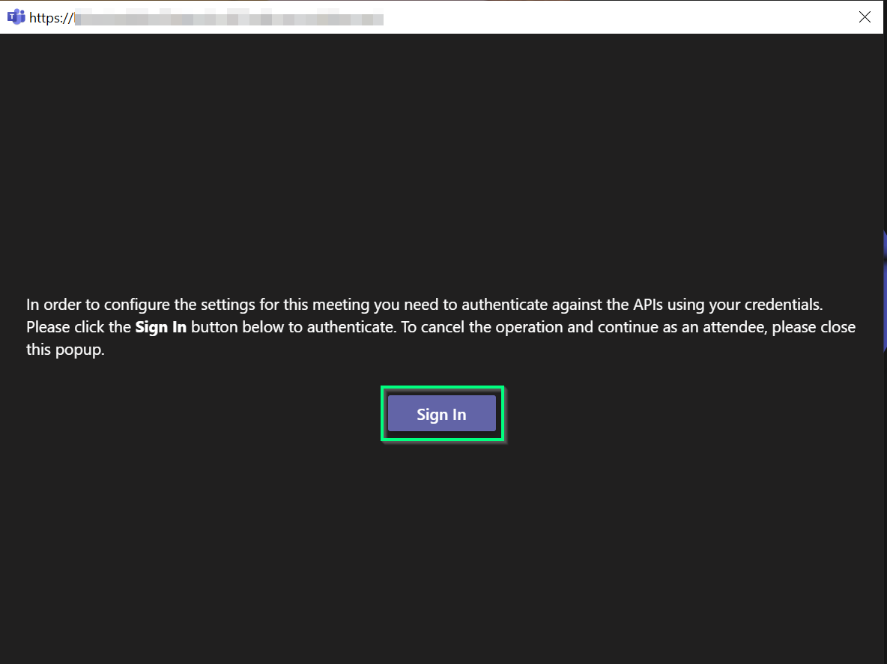

>**NOTE**: At the first time you will ask to consent permissions.

>**NOTE**: If you close the authentication window popup, the attendee view will be displayed. Please refer to the [Attendee view](#attendee-view) section.

### Join the Bot into the meeting
As we mentioned above, if the bot is not already joined in the meeting, this view will be displayed. To join the bot into the current meeting, the Bot Service must be provisioned otherwise, the `Join Meeting` button will appear disabled. 

If the Bot Service is not provisioned, please click on the `Start` button located at the right of the Bot Service status. After a few minutes, the service will be provisioned and the `Join Meeting` button will enable, click on it to join the bot into the meeting.

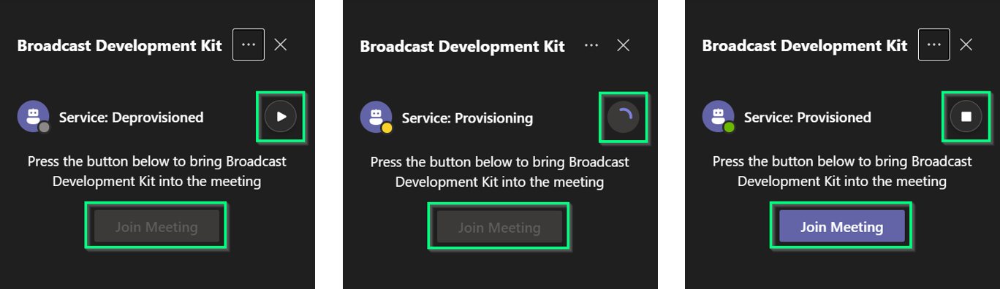

After a few seconds, the bot will be joined as another participant.

> **NOTE:** To be able to invite the Bot into a meeting, a Microsoft Teams meeting needs to be scheduled.

### Call details view
Once the call is established, a call details view will be rendered. In this view you will see the following sections:
- [Call Status Header](#call-status-header).
- [Injection Stream](#injection-stream).
- [Broadcast Outputs](#broadcast-outputs).
- [Main Streams](#main-streams).
- [Participants](#participants).

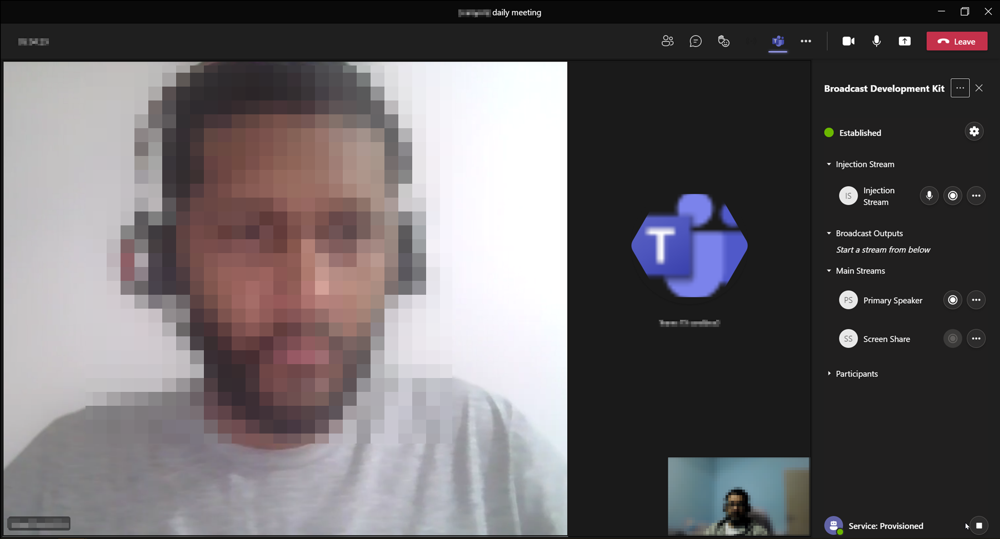

#### Call Status Header
This section shows the current status of the call and allows to configure the default settings for the meeting.

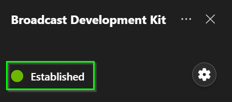

To configure the default settings, you just need to click on the `Configuration` icon located at the right in the section. 

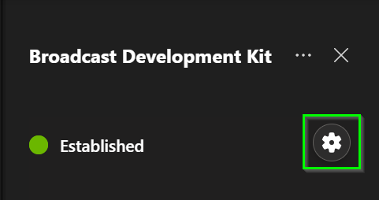

>**NOTE**: Currently the supported protocols for both extraction and injection are RTMP (selected by default) and SRT.

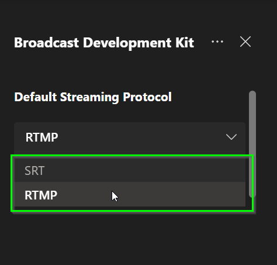

You can select the protocol and save the option selected by clicking on the `Save` button. By default the streaming protocol selected is RTMP.

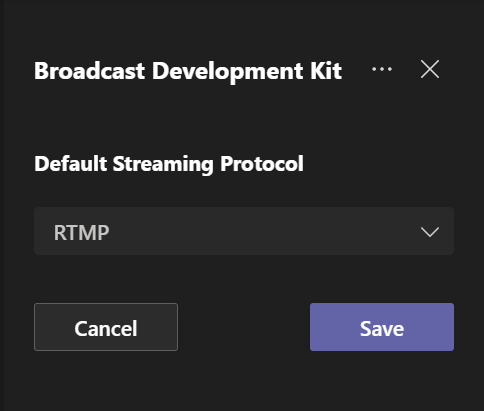

#### Injection Stream
This section displays a `Card` that allows you to configure and start the stream injection into the current meeting. To start an injection please refer to the section [How to inject a stream into the meeting](#how-to-inject-a-stream-into-the-meeting)

#### Broadcast Outputs
This section renders a `Card` for each [Main Stream](#main-streams) and [Participant](#participants) stream/s being extracted. In those `Cards` you can find the information related to each extracted stream and stop the extraction from there.

#### Main Streams
This section renders a `Card` for each `Main Stream` available for the current call from where you can start the stream extraction. The `Main Stream` are:

- Primary Speaker.
- Screen Share.
- Together Mode.
- Large Gallery.

>**NOTE**: The `Together Mode` and the `Large Gallery` are only visible in this section if they were previously activated in the meeting.

#### Participants
This section renders a `Card` for each participant present in the meeting from where you can start the stream extraction.

### How to inject media content into the meeting
To inject media content into the meeting you need to go to the [Injection Stream](#injection-stream) section and click the `Record` button. 

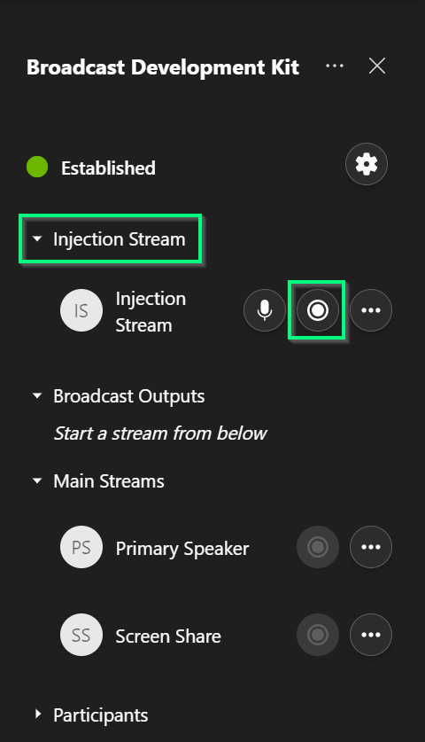

After clicking on the `Record` button, a new view with the options to configure will be displayed. You will need to configure these settings:

- Protocol: Select between the SRT and RTMP protocols.
- Mode: Select the mode in which you want to operate
    - For SRT: Listener or Caller.
    - For RTMP: Pull or Push.

Additionlly, based on the protocol and mode selected you will need to configure other properties, for example:

- SRT Protocol:
    - Injection URL (only for `Caller` mode).
    - Latency (optional).
    - Passphrase (optional).
    - Key Length (optional).
- RTMP Protocol: 
    - Injection URL (only for `Pull` mode).
    - Enable SSL (to stream over RTMP or RTMPS).

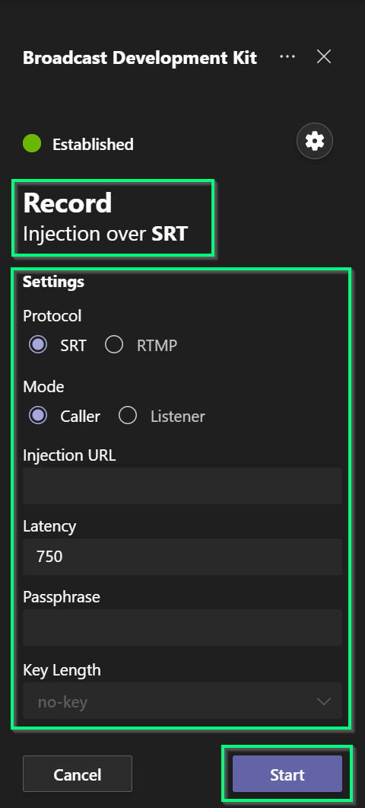

>**NOTE**: The injection URL for SRT in `Caller` mode or RTMP in `Pull` mode, is the URL where the Bot Service will establish the connection to pull the content.

In the new view displayed please configure the settings and press the `Start` button 

Finally, click on the `Start` button to start the injection. You will be returned to the call details view. Additionally, you can find the information related to the injection started by clicking on the `...` button in the `Card` of the [Injection Stream](#injection-stream) section.

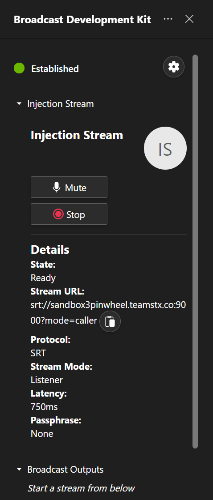

>**NOTE**: You can mute/unmute the audio injected from the bot by clicking on the `Mic` button.

>**NOTE**: To close the expanded view, please click on the avatar image located at the top right side.

To stop the stream injection you just need to click on the same `Record` button in collapsed view or click on the `Stop` button in the expanded view.

### How to extract media content from the meeting
To extract media content from the meeting you need to go to the Main Streams or Participants section. In the corresponding stream `Card` you want to extract click on the `Record` button.

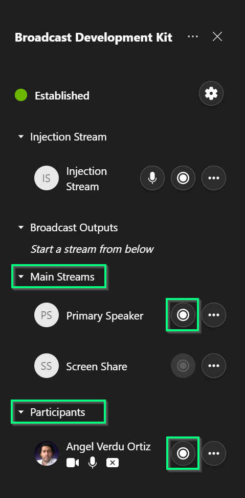

Similar to the injection, a new view will be displayed with the options to configure and start the extraction. After that, you will be returned to the call details view. 

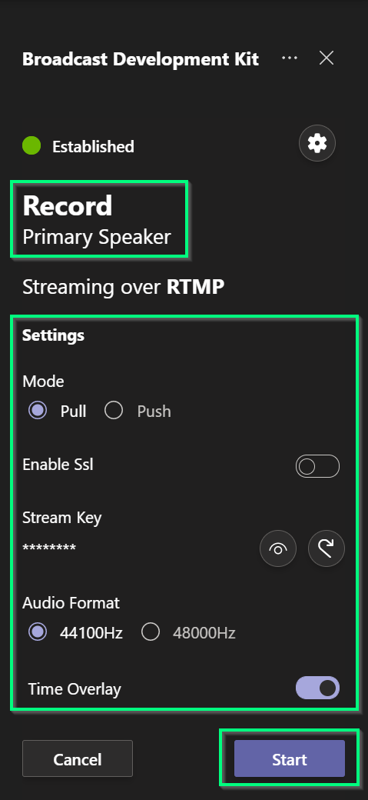

>**NOTE**: Based on the protocol configured and the mode selected you need to configure different options in the settings view.

Finally, to start the extraction, click on the `Start` button located at the bottom right of the settings view.

For information related to the extraction, go to the [Broadcast Outputs](#broadcast-outputs) section and click on the three dots `...` button at the right of the corresponding extraction `Card` to expand it.

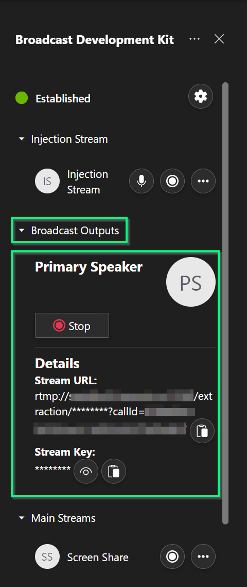

>**NOTE**: To close the expanded view, please click on the avatar image located at the top right side. 

### Stream key for RTMP protocol
When the bot is joined into the meeting, a stream key is generated. This value is used for both, injection in push mode and extraction in pull mode. 

The stream key is displayed (obfuscated) in the settings view. It can be regenerated by clicking on the `Refresh Stream Key` button placed at the right where the value is displayed.

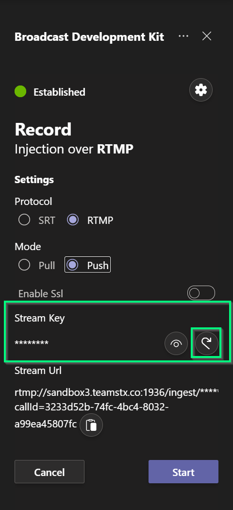

>**NOTE**: As was mentioned above, the stream key value is common for injection in push mode and all extractions that start in pull mode. Please stop all active streams in the corresponding modes before regenerating this value.

### Attendee view
For users without the required permission to operate BDK, this view will be displayed to indicate that the meeting is being broadcasted and probably recorded.

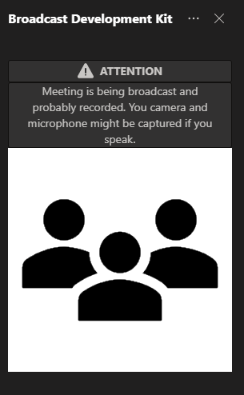

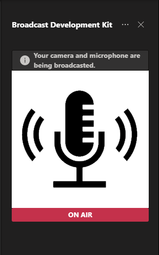