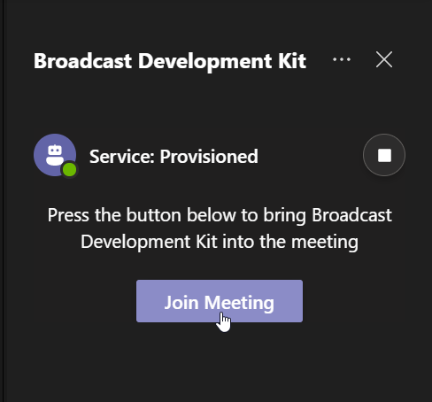

# How to use the Meeting App solution

## Introduction

## Getting Started
This document explains how to operate the Broadcast Development Kit (BDK) through the Meeting App. This includes:

- [Install Meeting App](#install-meeting-app).
- [Open the Meeting App](#open-the-meeting-app).
- [Producer view](#producer-view).
    - [Authentication](#authentication).
    - [Join the Bot into the meeting](#join-the-bot-into-the-meeting).
    - [Call details view](#call-details-view).
    - [Call info status and streaming protocol configuration](#call-info-status-and-streaming-protocol-configuration).
    - [How to inject a stream into the meeting](#How-to-inject-a-stream-into-the-meeting).
    - [How to extract a stream from the meeting](#how-to-extract-a-stream-from-the-meeting).
- [Attendee view](#attendee-view).

### Install Meeting App
To add the BDK Meeting App to our Microsoft Teams Client and be able to use it in a meeting, you must follow the steps described in this [document](../how-to-run-the-solution-locally/README.md#upload-your-application-to-teams).

### Open the Meeting App
To open the BDK Meeting App, please go to the top bar in the Microsoft Teams meeting window and click on the icon associated with the BDK Metting App to open it.

### Producer view
The producer view allows users to manage the BDK in the same way as in the portal. Once you have been successfully authenticated, the BDK Meeting App will render the Join Call view as long as the bot has not been joined to the meeting before otherwise, the [Call details view](#call-details-view) will be displayed.

### Authentication
Once you clicked on the icon, the BDK Meeting App is displayed on the right side of the meeting window. However, before rendering the content, the BDK Meeting App checks if the user can manage BDK.

Based on the user role, the Meeting App will render different views.

For users who can operate BDK, an authentication popup window will be displayed. You just need to click on the `Sign In` button and you will be ready to use the BDK Meeting App. 

>**NOTE**: At the first time you will ask to consent permissions.

>**NOTE**: If you close the authentication window popup, the attendee view will be displayed. Please refer to the [Attendee view](#attendee-view) section.

### Join the Bot into the meeting
As we mentioned above, if the bot is not already joined in the meeting, this view will be displayed. To invite the bot to the meeting, you just need to click on the `Join Meeting button`. 

After a few seconds, the bot will be joined as another participant.

> **NOTE:** To be able to invite the Bot into a meeting, a Microsoft Teams meeting needs to be scheduled.

### Call details view
Once the call is established, a call details view will be rendered. In this view you will see the following sections:
- [Call Status Header](#call-status-header).
- [Injection Stream](#injection-stream).
- [Broadcast Output](#broadcast-output).
- [Main Streams](#main-streams).
- [Participants](#participants).

#### Call Status Header
This section shows the current status of the call and allows to configure the default settings for the meeting.

To configure the default settings, you just need to click on the `Configuration` icon located at the right in the section. 

>**NOTE**: Currently the supported protocols for both extraction and injection are RTMP (by default) and SRT.

You can select the protocol and save the option selected by clicking on the `Save` button. By default the streaming protocol selected is RTMP.

#### Injection Stream
This section displays a `Card` that allows you to configure and start the stream injection into the current meeting. To start an injection please refer to the section [How to inject a stream into the meeting](#how-to-inject-a-stream-into-the-meeting)

#### Broadcast Outputs
This section renders a `Card` for each [Main Stream](#main-streams) and [Participant](#participants) stream/s being extracted. In those `Card` you can find the information related to the extracted stream itself and stop the extraction from there.

#### Main Streams
This section renders a `Card` for each `Main Stream` available for the current call from where you can start the stream extraction. The `Main Stream` are:

- Primary Speaker.
- Screen Share.
- Together Mode.
- Large Gallery.

>**NOTE**: The `Together Mode` and the `Large Gallery` are only visible in this section if they were previously activated in the meeting.

#### Participants
This section renders a `Card` for each participant present in the meeting from where you can start the stream extraction.

### How to inject a stream into the meeting

### How to extract a stream from the meeting

### Attendee view
For users without the required permission to operate BDK, this view will be displayed to indicate that the meeting is being broadcasted and probably recorded.

